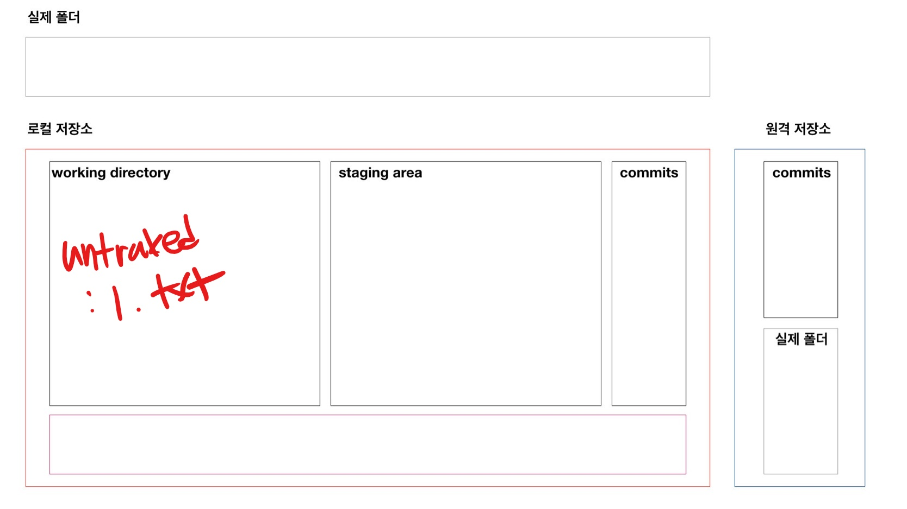
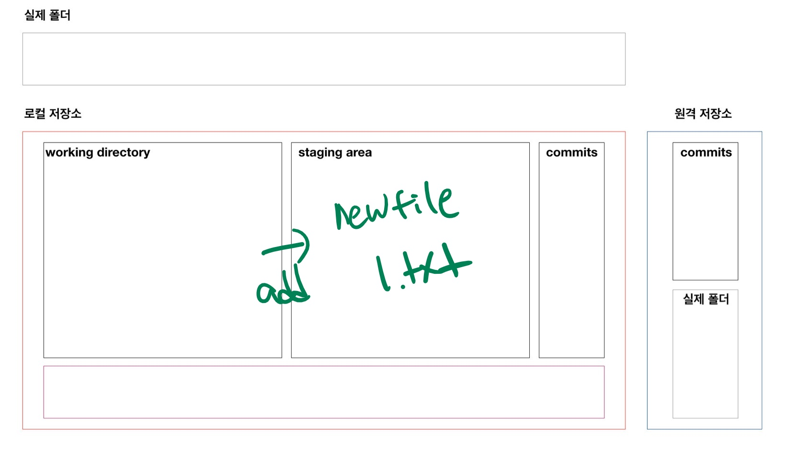
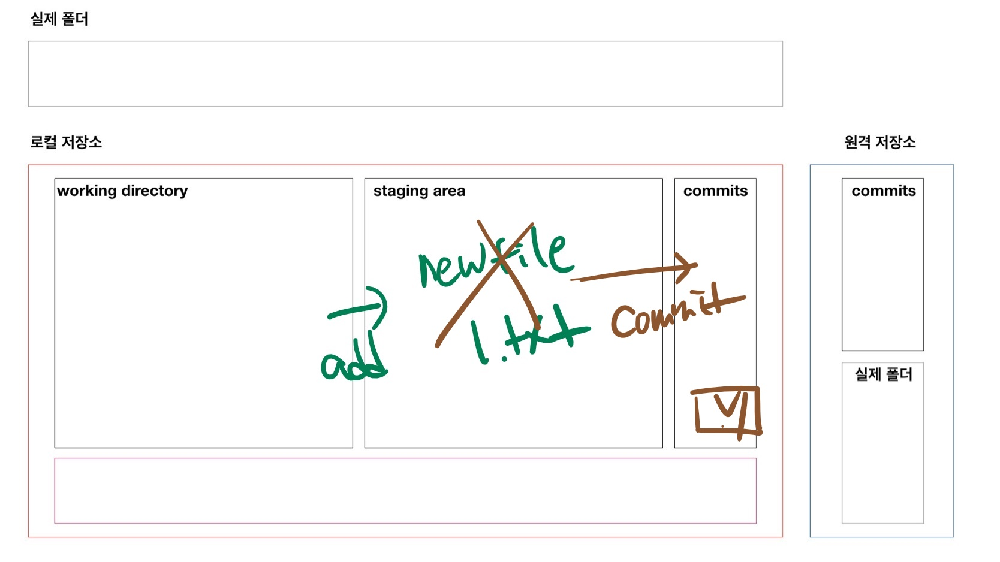

# Git

> DVCS, 분산버전관리시스템

## 로컬 저장소 설정

```bash
$ git init
Initialized empty Git repository in 
C:/Users/배경륜/Desktop/md/.git/
(master) &
```

* ``` .git```  숨김 폴더가 생성된다.
* ```(master)``` 브랜치 표기가 된다.

## 기본 흐름

> 어떠한 작업 => ```&touch 파일명```   

```bash
$ git status
$ git status
On branch master

No commits yet
# 트래킹이 X 파일들
# 버전에 기록된 적 없는 파일들
# => 파일 생성 등
Untracked files:
  (use "git add <file>..." to include in what will be committed)
        1.txt
# 커밋을 할 파일이 없다. (SA X) 2번통
# but, untracked files은 있다. (WD O) 1번통
nothing added to commit but untracked files present (use "git add" to track)
```

### add

```bash
$ git add . #현재 디렉토리(하위까지)
$ git add a.txt #특정 파일
$ git add test/ #특정 폴더
```

```bash
$ git add .
$ git status
$ git status
On branch master

No commits yet
#커밋이 될 변경사항들 (SA O)
Changes to be committed:
  (use "git rm --cached <file>..." to unstage)
        new file:   1.txt
```

### commit

> 스냅샷, 버전을 새롭게 만듦

```bash
$ git commit -m '커밋메시지' 
[master (root-commit) 2119ae5] Add 1.txt
 1 file changed, 0 insertions(+), 0 deletions(-)
 create mode 100644 1.txt
```

* 해시값이 고유한 커밋을 의미

  예) ```2119ae5459eaa089e7eff495fb0dd3bb4b02be97```

* 커밋메시지는 반드시 현재 작업 내용을 나타낼 수 있도록 잘 작성하는 것이 중요하다.

### status

```bash
$ git status
```

### 커밋 히스토리(log)

```bash
$ git log
commit 2119ae5459eaa089e7eff495fb0dd3bb4b02be97 (HEAD -> master)
Author: bicycle92 <bicyclebae@naver.com>
Date:   Thu Jan 7 14:18:36 2021 +0900

    Add 1.txt
$ git --oneline    # 한 줄로 갼략히
2119ae5 (HEAD -> master) Add 1.txt
$ git log -2       # 최근 2개의 커밋 
$ git -1 --oneline # 최근 2개의 커밋을 한 줄로
```


